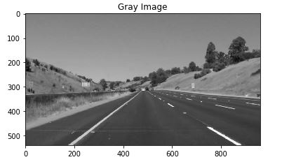
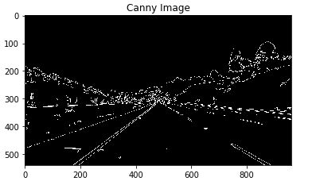
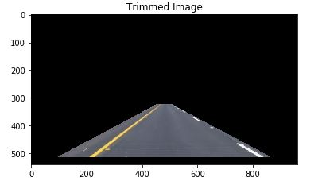
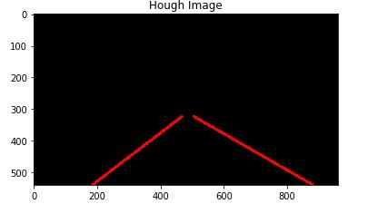
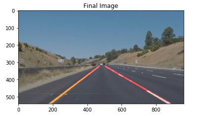

# **Finding Lane Lines on the Road** 

---

**Finding Lane Lines on the Road**

The goal of this project is to generate simple lines from the code where we have lanes on the road. 
The method used here is a simple image processing which has the following steps:
    - convert the image from color to gray image
    - apply Canny Method to determine the edges
    - trim the image regarding a region of interest which is a trapeze
    - apply Hough Transform to determine the lines
    - use a weight method to draw the lines on the images
    
[//]: # (Image References)

[image1]: ./examples/grayImage.jpg "Grayscale"
[image2]: ./examples/cannyImage.jpg "Canny"
[image3]: ./examples/trimmedImage.jpg "Trim"
[image4]: ./examples/houghImage.jpg "Hough"
[image5]: ./examples/resultImage.jpg "Result"
---

### Reflection

#### 1. Describe your pipeline. As part of the description, explain how you modified the draw_lines() function.

My pipeline consisted of 5 steps. 
- the first one was to convert the image to grayscale, using openCV cvtColor.

  

- the second one was to apply Canny Transform to the grayscale image, using Canny function from openCV library with the values for the threshold [50, 150]

  

- the third step was to determine a region of interest, which is a trapeze with the big base at the bottom of the image and the little base around the middle of the image.

  

- the fourth step was the most important because here I called the Hough Transform and then, after that, the method draw_lines was used. That method was used in the following case: having a set of points which are the points of the lines edges, apply a polyfit method (a linear regression - least squares method) to determine the line which "intersects" all of those points.

  

- the fifth and the last step was to put the lines determined previously on the initial image.

  

#### 2. Potential shortcomings with the pipeline

One potential shortcoming would be what would happen when we have a curvature in the lanes because there is a posibility that our region of interest will trim a lot from the meaningful part of the image, where we have the information about the lanes lines.
Another shortcoming is that the algorithm is sensitive to the modification of the luminosity.

#### 3. Possible improvements to the pipeline

A possible improvement would be to dynamically detect the lanes with a method as sliding window. That method will give us the opportunity to detect the lanes even if we have a curvature in the road.

